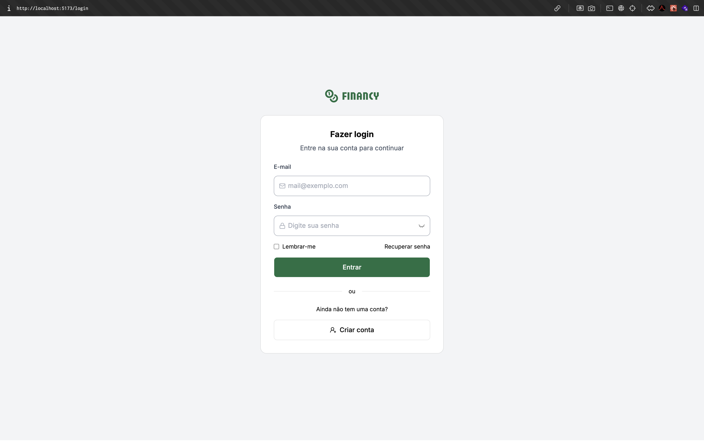

# pos-financy

## Como rodar a aplicação:

### Frontend:

1. Acesse `./frontend`
2. Crie um arquivo `.env` na raiz do projeto
3. Preencha o arquivo `.env` com as mesma variáveis contidas em `.env.example`
5. Instale as depêndencias com o comano `npm install`
4. Rode o comando `npm run dev`

### Backend:

1. Acesse `./backend`
2. Crie um arquivo `.env` na raiz do projeto
3. Preencha o arquivo `.env` com as mesma variáveis contidas em `.env.example`
5. Instale as depêndencias com o comano `npm install`
6. Rode as migrações do projeto `npx prisma migrate dev`
4. Rode o comando `npm run dev`

## Acessando o APP:

- Basta acessar a url local utilizando as portas configuradas, por exemplo: `http://localhost:5173/login`

### Resultado Esperado:

